# XEB+ neutrino Launcher Plugin

This is a plugin for the Xtreme Elite Boot Plus dashboard for the PlayStation 2.  
It allows XEB+ to load PlayStation 2 games from HDD, MX4SIO, USB, and UDPBD via [neutrino](https://github.com/rickgaiser/neutrino).

## Features

  * Load PlayStation 2 game backups straight from the Xtreme Elite Boot Plus dashboard.
  * Supports game loading from HDD, MX4SIO, MMCE, USB, and UDPBD.
  * Supports high capacity exFAT drives (currently tested with drives up to 4TB).
  * Works with fragmented game files.
  * Quick navigation functions for browsing large game lists.
  * Remember last 10 games played.
  * Display game-specific artwork on the menu.
  * Display metadata for each game.
  * Set neutrino compatibility flags and other options on a global or per-game basis.
  * Change video modes via GSM.
  * Virtual Memory Cards.
  * Cheat support.
  * Favorites list.
  * Custom theme integration.

## Requirements

  * A PlayStation 2 console configured to run unsigned code via a custom boot loader.  
[PS2BBL](https://israpps.github.io/PlayStation2-Basic-BootLoader/) is the recommended option.
  * All of the requirements specific to the device you want to load games from.
 
### HDD

  * A Phat PlayStation 2 console.
  * A PlayStation 2 network adapter or hard drive add-on.
  * A hard drive or SSD that is compatible with your PlayStation 2 network or hard drive adapter.  
  * A FAT32 or exFAT formatted USB drive 1GB or larger.  
  This is used for XEB+ and assorted files.
  * A computer with a recent version of [Python](https://www.python.org/) installed.
  * A PC hard drive dock or USB adapter (optional).
    
### MX4SIO

  * An MX4SIO adapter
  * An exFAT formatted SD card no less than 4GB in size.  
32GB or larger is recommended.
  * A FAT32 or exFAT formatted USB drive 1GB or larger.  
  This is used for XEB+ and assorted files.
  * A computer with a recent version of [Python](https://www.python.org/) installed.
  * A USB SD card reader (optional).

### MMCE

  * An MMCE compatible device, such as a MemCard Pro 2 or SD2PSX.
  * A micro SD card no less than 4GB in size.  
32GB or larger is recommended.
  * A FAT32 or exFAT formatted USB drive 1GB or larger.  
  This is used for XEB+ and assorted files.
  * A computer with a recent version of [Python](https://www.python.org/) installed.
  * A USB micro SD card reader (optional).
    
### USB

  * An exFAT formatted USB drive no less than 4GB in size.  
32GB or larger is recommended.
  * A PS2 boot loader that can read exFAT drives.  
PS2BBL supports this by default. ExFAT support can be added to FreeMcBoot with [BDM Assault](https://github.com/israpps/BDMAssault).
  * A computer with a recent version of [Python](https://www.python.org/) installed.


### UDPBD

  * An OEM network adapter if using a fat PS2.
  * A Windows or Linux PC with a connected exFAT formatted drive with enough free space for game ISOs.
  * A FAT32 or exFAT formatted USB drive 1GB or larger.  
  This is used for XEB+ and assorted files.
  * An ethernet cable to connect the PS2 to the PC.  
If your PC does not have an Ethernet port available, a USB Ethernet adapter will work.

## Setup

*Note: This setup process is for version 2.6 of this plugin.  
If you are updating from version 2.5 or earlier, you may need to remove the `XEBPLUS/CFG/neutrinoLuancher` folder on your USB drive.  
If you are updating from version 2.3 or earlier, you will need to rebuild all of your game lists.  
If you are updating from version 1.x, you will need to remove the old version of neutrino Launcher from your XEB+ install before continuing. This includes all neutrino Launcher files in the `APPS`, `PLG`, and `CFG` folders, as well as the `CD` and `DVD` folders on the root of your USB drive.*

1. If you have not already done so, download the Xtreme Elite Boot Plus Xmas 2021 showcase [here](http://web.archive.org/web/20221225042045/http://www.hwc.nat.cu/ps2-vault/hwc-projects/xebplus/).
2. Extract the `XEBPLUS` folder to the root of your USB drive, and ensure that you can load into the XEB+ dashboard on your PlayStation 2.
Use [7-zip](https://7-zip.org/) to extract the `XEBPLUS` folder to the root of your USB drive. (Windows does not natively support `.rar` with passwords.)  
The password is at the bottom of `xebplus_xmas_showcase.rar\Distribution License.txt`.  
Note that if you are using an exFAT formatted USB drive, you will need to use PS2BBL and [this version](https://github.com/israpps/wLaunchELF_ISR) of wLaunchELF. 
4. (optional) Configure your PS2 exploit of choice to autorun XEB+ on startup.
5. Download the latest version of this plugin from the [Releases](https://github.com/sync-on-luma/xebplus-neutrino-loader-plugin/releases) section.  
Extract the `XEBPLUS` folder to the root of your USB drive, merging all folders if prompted.
6. Extract the List Builder directory to a known location on your computer.
7. Complete setup by following the steps specific to the device you want to load games from.


### HDD

7. Connect your hard drive or SSD to a computer, and format it as an exFAT partition.  
8. Create folders named `CD` and `DVD` on the root of the hard drive.  
9. Rip/copy any PlayStation 2 disc images you wish to load into the folder that corresponds with their original source media.  
All disc images must be in *.iso* format.  
10. Run `GUI.py` from the included `List Builder` folder, and select *PS2 HDD* under *Drive Type*.  
11. Click the *Choose Directory* button under *XEBPLUS Location* and navigate to the root of the USB drive containing your XEB+ install.  
12. Click the *Choose Directory* button under *Games Location* and navigate to the root of your hard drive.  
13. Click the *Create VMCs* checkbox if you wish to use virtual memory cards.  
13. Click *Build List* and wait for the process to complete.  
14. Eject both drives from the computer. Connect the hard drive / SSD to the PlayStation 2 via the network adapter, and plug the USB drive into either of the front USB ports.  
15. Launch XEB+ on the PS2, and use *neutrino Launcher (HDD)* to load games from the hard drive.  

Repeat steps 9-13 to add or remove games on the hard drive.


### MX4SIO

7. Connect your SD card to the computer, and format it as an exFAT partition.  
8. Create folders named `CD` and `DVD` on the root of the SD card.  
9. Rip/copy any PlayStation 2 disc images you wish to load into the folder that corresponds with their original source media.  
All disc images must be in *.iso* format.  
10. Run `GUI.py` from the included `List Builder` folder, and select *MX4SIO* under *Drive Type*.  
11. Click the *Choose Directory* button under *XEBPLUS Location* and navigate to the root of the USB drive containing your XEB+ install.  
12. Click the *Choose Directory* button under *Games Location* and navigate to the root of your SD card.  
13. Click the *Create VMCs* checkbox if you wish to use virtual memory cards.  
13. Click *Build List* and wait for the process to complete.  
14. Eject both drives from the computer. Insert the SD card into an MX4SIO adapter and connect it to memory card slot 2 on the PlayStation 2. Plug the USB drive into either of the front USB ports.  
15. Launch XEB+ on the PS2, and use *neutrino Launcher (MX4SIO)* to load games from the SD card.  

Repeat steps 9-14 to add or remove games on the SD card.

### MMCE

7. Ensure you have completed the initial setup of your MMCE device according to it's instructions and that it's firmware has been updated to the latest version.
8. Insert your micro SD card into your MMCE device and format using the device firmware if you did not do this as part of the initial setup.
9. Connect the micro SD card to your computer and create folders named `CD` and `DVD` in it's root directory.
10. Rip/copy any PlayStation 2 disc images you wish to load into the folder that corresponds with their original source media.  
All disc images must be in *.iso* format.
11. Run `GUI.py` from the included `List Builder` folder, and select *MMCE* under *Drive Type*.  
12. Click the *Choose Directory* button under *XEBPLUS Location* and navigate to the root of the USB drive containing your XEB+ install.  
13. Click the *Choose Directory* button under *Games Location* and navigate to the root of your micro SD card.  
14. Click the *Create VMCs* checkbox if you wish to use virtual memory cards.  
15. Click *Build List* and wait for the process to complete.
14. Eject both drives from the computer. Insert the SD card into an MMCE adapter and connect it to memory card slot 1 on the PlayStation 2. Plug the USB drive into either of the front USB ports.  
15. Launch XEB+ on the PS2, and use *neutrino Launcher (MMCE)* to load games from the SD card.

Repeat steps 9-15 to add or remove games on the micro SD card.

### USB

7. Ensure your USB drive is formatted as an exFAT partition. You will need to reformat it and repeat steps 2-4 if it is not.  
8. Create folders named `CD` and `DVD` on the root of the USB drive.  
9. Rip/copy any PlayStation 2 disc images you wish to load into the folder that corresponds with their original source media.  
All disc images must be in *.iso* format.  
10. Run `GUI.py` from the included `List Builder` folder, and select *USB* under *Drive Type*.  
11. Click the *Choose Directory* button under *XEBPLUS Location* and navigate to the root of your USB drive.  
The *Games Location* will automatically be set to the same folder. 
12. Click the *Create VMCs* checkbox if you wish to use virtual memory cards.  
13. Click *Build List* and wait for the process to complete.  
14. Eject the USB drive and plug it into either of the front USB ports on the PlayStation 2.  
15. Launch XEB+ on the PS2, and use *neutrino Launcher (USB)* to load games from the USB drive.  

Repeat steps 9-13 to add or remove games on the USB drive.

### UDPBD

#### Windows

7. Somewhere on your PC, for example `Documents`, create a new folder `PS2`.
8. Inside the `PS2` folder, create `CD` and `DVD` folders.
9. Rip/copy any PlayStation 2 ISOs you wish to load into the folder that corresponds with their original source media.
10. All `.bin` + `.cue` CD games must be converted to `.iso` format.  
The sync app will convert them automatically if placed in the CD folder and check the `Convert CD Bin to ISO` box before synchronizing.
11. From the [latest release on this page](https://github.com/MegaBitmap/UDPBD-for-XEBP/releases), extract the `UDPBD-for-XEB+ Sync App` folder.
12. Plug in the ethernet cable as shown:  
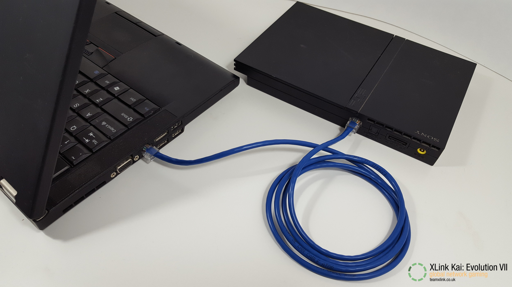
13. For a direct connection, as seen in the previous step, set a manual IPv4 address and subnet mask.  
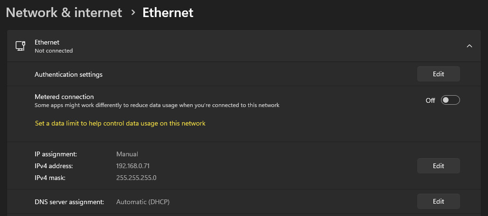  
For using a router instead of a direct connection, set the PC's IP assignment to *Automatic (DHCP)*.  
Then [follow this guide](http://ps2ulaunchelf.pbworks.com/w/page/19520139/ps2ftp) for assigning a proper IP address on the PS2.  
LaunchELF defaults to *192.168.0.10* and needs to be changed manually to work on your network.
14. Hold *R1* on the controller during FreeMCBoot/PS2BBL startup to open LaunchELF.  
Open MISC -> PS2Net  
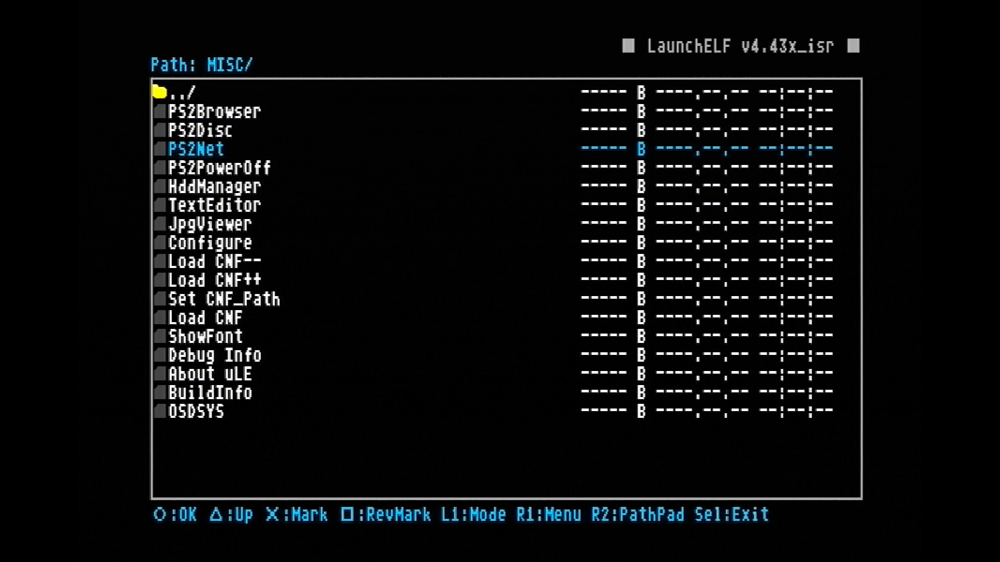  
15. Let the PS2 idle on this screen for the next steps on the PC.  
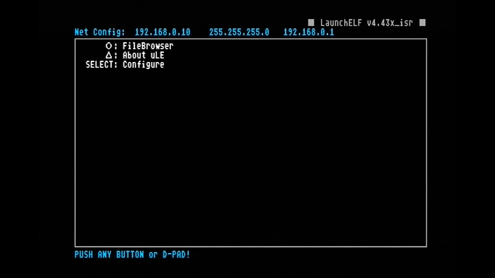
16. Run `UDPBD-for-XEB+-GUI.exe` and click connect.  
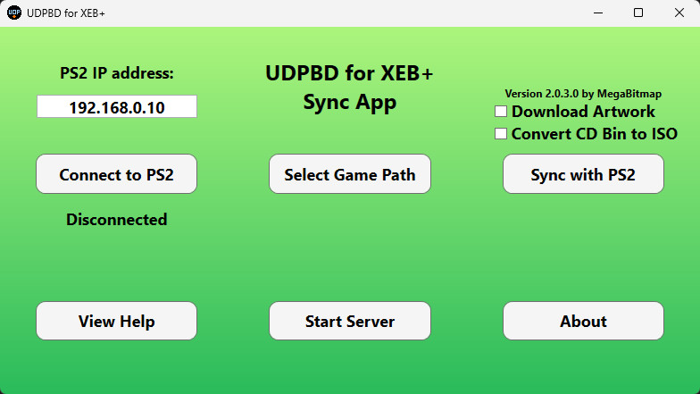
17. Click `Select Game Path` then choose an ISO from the `DVD` folder from step 8.
18. Click `Sync with PS2`, upon success this message will be displayed:  
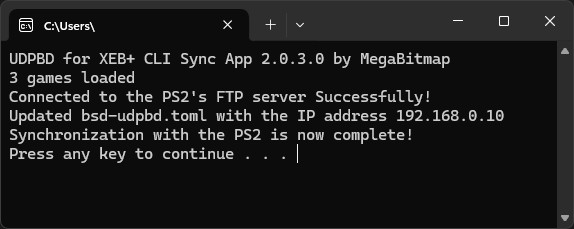
19. Click `Start Server` and make sure to allow.  
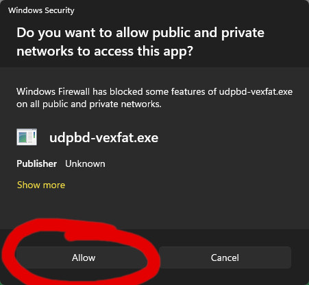  
If you miss clicked, either move the `UDPBD-for-XEB+` folder inside a new folder or manually delete the inbound rules for `udpbd-vexfat` in `Windows Defender Firewall with Advanced Security`.  
udpbd-vexfat will open minimized.  
The server needs to be open and running for the entire play session. (Disable sleep on the PC.)
20. The PC setup is now complete, back on the PS2 run XEB+.  
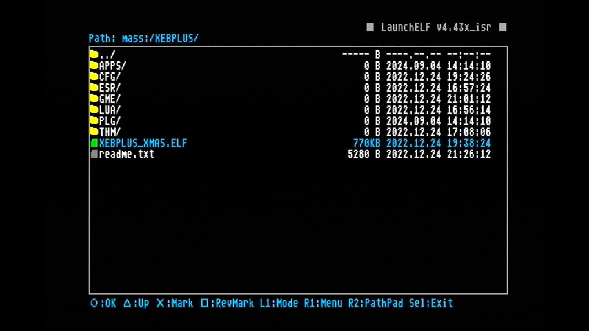
It's recommended to set FreeMCBoot or PS2BBL to autorun the `.ELF` file.
21. Play!  
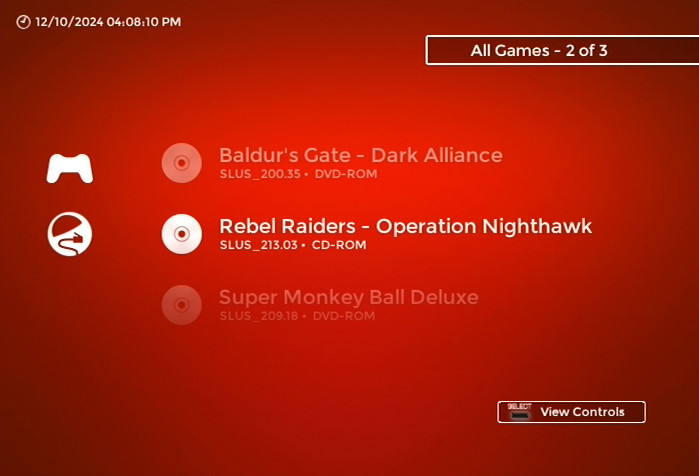  

Repeat steps 14-21 of the setup process after adding or removing games.

#### Linux

This setup is for Ubuntu, if you are using a different distribution these steps may vary.

7. Compile the udpbd-server
```
sudo apt update
sudo apt upgrade
sudo apt install git build-essential
git clone https://gitlab.com/ps2max/udpbd-server.git
cd udpbd-server
make
```
8. Install .NET 8, GParted, and exfatprogs
```
sudo apt install dotnet-runtime-8.0 gparted exfatprogs
```
9. Create a new exFAT partition in GParted and note the partition number.  
For this guide the exFAT partition is `/dev/nvme0n1p6`, it will most likely be slightly different on your system.  
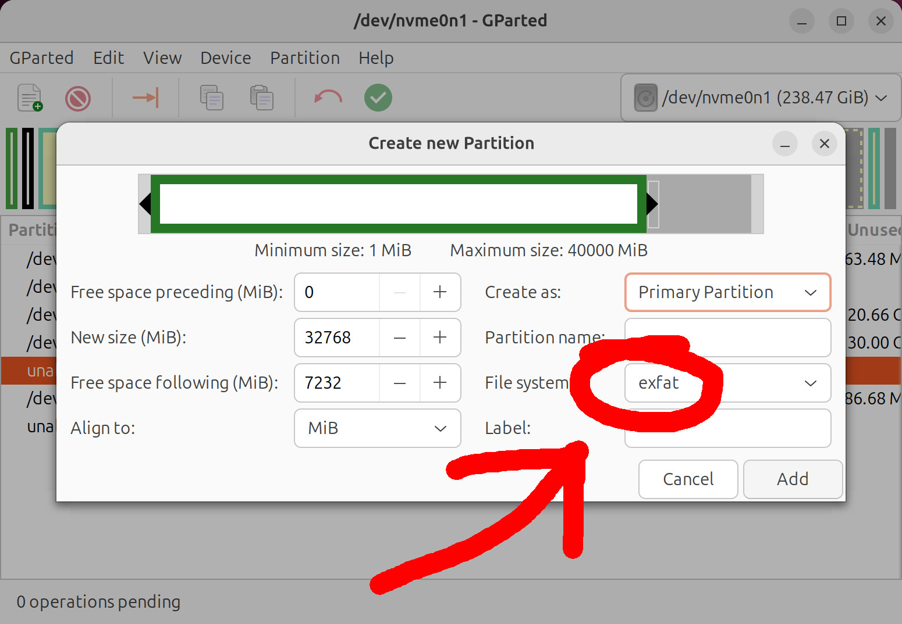
10. Mount it to `/mnt/ps2`. Your storage device `/dev/nvme0n1p6` will probably be different.
```
sudo mkdir /mnt/ps2/
sudo mount /dev/nvme0n1p6 /mnt/ps2/ -o uid=$USER
```
11. Create folders named `CD` and `DVD` in the exFAT partition.  
Rip/copy any PlayStation 2 disc images you wish to load into the folder that corresponds with their original source media.  
Example:  `/mnt/ps2/DVD/Grand Theft Auto III.iso`
12. From the [latest release on this page](https://github.com/MegaBitmap/UDPBD-for-XEBP/releases), extract the `UDPBD-for-XEB+ Sync App` folder.
13. Plug in the ethernet cable as shown:  

14. For a direct connection, as seen in the previous step, set a manual IPv4 address and subnet mask.  
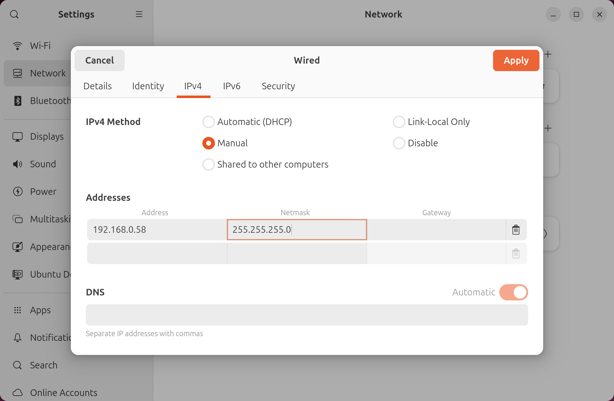  
For using a router instead of a direct connection, set the PC's IP assignment to *Automatic (DHCP)*.  
Then [follow this guide](http://ps2ulaunchelf.pbworks.com/w/page/19520139/ps2ftp) for assigning a proper IP address on the PS2.  
LaunchELF defaults to *192.168.0.10* and needs to be changed manually to work on your network.
15. Hold *R1* on the controller during FreeMCBoot/PS2BBL startup to open LaunchELF.  
Open MISC -> PS2Net  
  
16. Let the PS2 idle on this screen for the next steps on the PC.  

17. Run the sync app, please note that these are example parameters.
```
dotnet UDPBD-for-XEB+-CLI.dll -path /mnt/ps2 -ps2ip 192.168.0.10 -bin2iso
```
18. Unmount the exFAT partition then Start the udpbd-server.
```
sudo umount /mnt/ps2
sudo ./udpbd-server /dev/nvme0n1p6
```
The server needs to be open and running for the entire play session.
19. Launch XEB+ then Play!
To add or remove games, stop the server then mount the exFAT storage device to `/mnt/ps2`  
```
sudo mount /dev/nvme0n1p6 /mnt/ps2/ -o uid=$USER
```
Then add your games and repeat steps 15-19 of the Linux setup process.


### Adding Artwork

The neutrino Launcher plugin can display game-specific artwork in the selection menu.  
This feature uses the same file type and naming conventions as Open PS2 Loader, which allows the plugin to take advantage of existing PS2 artwork libraries designed for OPL.  
 To make use of this feature, the following additional steps are required:

1. Prepare or acquire artwork files with the same file format and naming conventions as those used by OPL.
    * Only background art (*_BG*) and disc icon (*_ICO*) files are used by this plugin.
    * Some recent versions of OPL have added support for 128x128 disc icons. While these are technically supported, it is recommended to only use the older 64x64 icons.
2. Copy the artwork files you wish to use to `/ART` or `/XEBPLUS/GME/ART` on your USB drive.
    * If it exists, the `ART` directory on the USB root will always take priority over `/XEBPLUS/GME/ART`.
3. Launch XEB+ and select one of the neutrino Launcher plugins.  
    * If the plugin detects files in one of the artwork directories, it will automatically create an artwork cache in the `CFG/neutrinoLauncher` folder.
    * This is necessary to maintain a usable level of performance while displaying artwork in the menu.

The caching process can take a long time to complete the first time it runs, potentially over an hour if you have a very large game library.  

Making any changes to any of the *.list* files in the `CFG/neutrinoLauncher` folder, or modifying the cache folder will trigger a refresh of the artwork cache the next time the plugin is launched.  
A refresh can also be triggered manually from the plugin settings.  
Cache refreshes take much less time than initial creation, so long as the cache folder has not been moved or deleted.

### Adding Cheats

The neutrino Launcher can be set to load [Cheat Device](https://israpps.github.io/CheatDevicePS2/) prior to starting a game. This allows for the use of Action Replay / Gameshark style cheat codes.  
To make use of this feature, the following additional steps are required. 

1. Create or acquire cheat database (*.cht*) files in Cheat Device format.
    * Database files should only contain cheats for a single game.
    * Database files must be named by PlayStation 2 title ID using this format: `SLUS_123.45.cht`
2. Create a directory called `CHT` on the root of the USB drive containing your XEB+ install.
3. Copy your *.cht* files to the `CHT` directory.

A collection widescreen patch codes in the correct format can be found [here](https://github.com/sync-on-luma/PS2-widescreen-cheats). Other cheat codes will need to be converted from other collections or added by hand.

### Controls

CROSS -         **confirm / launch game**  
CIRCLE / LEFT - **cancel / close plugin**  
SQUARE -        **open context menu**  
TRIANGLE -      **show favorites / show recents / show all**  
DOWN -          **scroll down**  
UP -            **scroll up**  
R1 -            **scroll down 5 items**  
L1 -            **scroll up 5 items**  
R2 -            **scroll down 15 items**  
L2 -            **scroll up 15 items**  
R3 -            **jump to bottom of list**  
L3 -            **jump to top of list**  
SELECT -        **view control map**

### Basic Usage

Launch the XEB+ dashboard on your PlayStation 2 console, and select the appropriate *neutrino Launcher* entry from the menu.  
Wait a moment for the plugin to load. If there are artwork files present, you may need to wait for the artwork cache to build or refresh.  
Select a game from the list to launch it with neutrino, or press back to close the plugin.  
Repeat steps 9-14 of the setup process for your drive type each time you wish to add or remove games.

### Game Options

Press SQUARE while in the game selection menu, and the context menu will open.  
Context menu options apply to the currently highlighted game by default, and are as follows:

  * **Add To Favorites** - Adds the current game to the favorites list. If the current game is already in the favorites list, this option will remove it.
  * **Global / Per-Game Settings** - This option toggles between Global and Per-Game settings modes.  
When set to Global Settings, options shown below this one will apply to all games.  
When set to Per-Game Settings, options shown below this one will apply only to the current game.
  * **Enable Cheat Device** - When enabled, Cheat Device will be injected into the game load sequence.  
  To start the selected game from within Cheat Device, press START, select *Start Game*, and choose the first option below *==Disc==*.
  * **Enable VMC** - When enabled, the selected game will save data to a virtual memory card image instead of the memory card in Slot 1 of the PS2.
  *  **Use Unique VMC** - If the selected game is in a memory card group, enabling this option will force it to use a dedicated VMC instead of the default group one.  
    More info on memory card groups can be found [here](https://github.com/sync-on-luma/xebplus-neutrino-loader-plugin/wiki/Memory-Card-Groups).
  * **Enable Boot Logo** - When enabled, the PlayStation 2 logo will be shown on screen when starting a game. This setting can affect compatibility, particularly for games that do not match your console's region.
  * **Enable Debug Colors** - When enabled, a series of colors will flash on screen when starting a game. This can be used to help diagnose games that will not start.
  * **Fast Reads** - When enabled, the data transfer rate for games will be able to exceed that of the PlayStation 2 DVD drive.  
  This will reduce load times if using UDPBD or a hard drive, but can cause compatibility issues with some titles.  
  * **Synchronous Reads** - When enabled, asynchronous (background) loading will not be used. This can affect load times, and fixes compatibility issues with some titles.
  * **Unhook Syscalls** - When enabled, neutrino Syscalls will be removed from memory after starting a game. This fixes compatibility issues with some titles.
  * **Emulate DVD-DL**- When enabled, neutrino will emulate the data structure of a dual-layer DVD. This option is required for DVD9 images that have been modified to fit a DVD5.
  * **Fix Buffer Overrun**- Fixes a compatibility issue present in a very small number of games.
  * **GSM**- Force the PS2 Graphics Synthesizer to use a specific video mode when running the selected game. The available modes are as follows:
    * Off - Use the game's default video mode.
    * Progressive - Use the progressive scan equivalent of the game's default video mode. This is 480p for NTSC titles and 576p for PAL.
    * Progressive 2X - The same as Progressive, but adds line doubling for a higher signal resolution.
    * Progressive Field-Flipped - The same as Progressive, but the video fields are reversed.
    * Progressive 2X Field-Flipped - The same as Progressive 2X, but the video fields are reversed.
  * **Refresh Artwork** - Immediately delete and re-copy cached artwork for the current game. This option is not affected by the current settings mode.

Closing the context menu will automatically save the currently selected options.  
Refer to the [compatibility list](https://github.com/sync-on-luma/xebplus-neutrino-loader-plugin/wiki/Compatibility-List) to find known-working configurations for specific games.

### Recent Games

The neutrino Launcher plugin keeps track of the ten most recently played games for each drive type. Recent games are stored in the recent games list in reverse chronological order.  

To access the recent games list, press TRIANGLE while on the game selection menu. Press TRIANGLE again to advance to the favorites list. 

### Favorites

Games can be added to a favorites list for easy organization and quicker access.  

The favorites list is shared between all four drive types, however only titles present on the currently selected drive will be displayed.  

To add a game to the favorites list, open the context menu and select "Add To Favorites", as described in the previous section. Repeat this process to remove a game from the favorites list.  
When a game is in the favorites list, it's title will be flanked by "●" on either side.  

To access the favorites list, press TRIANGLE while on the recent games list. Press TRIANGLE again to show all games.  
The plugin will always start up to the all games list, even if it was previously closed while viewing the favorites list.

### Neutrino Launcher Settings

This package includes a secondary plugin called *neutrino Launcher Settings*, which is accessible from the far right column of the XEB+ dashboard.  
This contains a settings menu whose options apply to the main neutrino Launcher plugins. The available options are as follows:
   
  * **Enable HDD** - When enabled, *neutrino Launcher (HDD)* will be available on the XEB+ dashboard.*
  * **Enable MX4SIO** - When enabled, *neutrino Launcher (MX4SIO)* will be available on the XEB+ dashboard.*
  * **Eanable MMCE** - When enabled, *neutrino Launcher (MMCE)* will be available on the XEB+ dashboard.*
  * **Enable USB** - When enabled, *neutrino Launcher (USB)* will be available on the XEB+ dashboard.*
  * **Enable UDPBD** - When enabled, *neutrino Launcher (UDPBD)* will be available on the XEB+ dashboard.*
  * **Enable iLINK** - When enabled, *neutrino Launcher (iLink)* will be available on the XEB+ dashboard.*
  * **Disable Disc Art** - When enabled, game specific disc icons will not be shown on the menu. This can decrease lag when browsing the list.
  * **Disable Background Art** - When enabled, game specific backgrounds will not be shown on the menu. This can improve performace when browsing the list.
  * **Disable Status Messages** - When enabled, the text that appears at the bottom of the screen to indicate loading and other behavior will not be shown.
  * **Disable Background Fading** - When enabled, background artwork will not fade in/out when the image changes.
  * **Disable Icon Animation** - When enabled, the disc icon for the currently highlighted game will not spin.
  *  **Show Title ID** - When enabled, each game's PlayStation 2 title ID will be shown under its title.
  *  **Show Media** - When enabled, each game's media type will be shown under it's title.
  * **Refresh Artwork Cache** - Sets artwork cache to refresh next time one of the neutrino Launcher plugins is loaded.
  * **Clean Artwork Cache** - Immediately scan the artwork cache for unused files and remove them.

*An XEB+ reboot/refresh is required for changes made to this setting to take effect.

Returning to the dashboard will automatically save the currently selected options.

## Integrating With Custom Themes

The six neutrino Launcher plugins and the settings plugin each use their own custom dashboard icon that is not normally present in XEB+.  
Versions of these icons that are visually consistent with the default XEB+ theme are included and will be loaded by default.  
Alternate icons will be used instead if icon files with the correct names are present in the current XEB+ theme folder.  

The filenames each plugin looks for are as follows:

  * *ic_tool_neutrino_hdl.png* - neutrino Launcher (HDD)
  * *ic_tool_neutrino_mx4.png* - neutrino Launcher (MX4SIO)
  * * *ic_tool_neutrino_mmce.png* - neutrino Launcher (MMCE)
  * *ic_tool_neutrino_usb.png* - neutrino Launcher (USB)
  * *ic_tool_neutrino_udpbd.png* - neutrino Launcher (UDPBD)
  * *ic_tool_neutrino_ilink.png* - neutrino Launcher (iLink)
  * *ic_set_neutrino_cfg.png* - neutrino Launcher Settings

If you wish to reference the included versions of these icons, they are located at `XEBPLUS/APPS/neutrinoLauncher/image/`.

## Troubleshooting

Here are some common issues that can occur with the neutrino Launcher plugin and possible fixes for them.

### Pluign reports "Error: Could not read \<file\>.list. The file may be missing or corrupted"
This error occurs when the game list file for the selected drive type is missing or severely malformed. Refer to the setup procedure for your drive type to (re)build the game list.

### PS2 reboots instead of starting a game
This behavior occurs when the *.iso* file for the selected game cannot be found. The console may hang on a black screen for up to 30 seconds before rebooting.  
Some things to check if you encounter this issue:
* Ensure your game drive is properly connected to the console. MX4SIO adapters must be in Memory Cart Slot 2, and MMCE devices in Memory Card Slot 1. Neither device type will work if connected through a multitap.
* Ensure the game you are trying to load is present on your game drive.
* Ensure your game drive is formatted as eXFAT.  If using an MMCE device, ensure the SD card has been formatted with the device firmware.
* Ensure the plugin is trying to load the correct file. This can be accomplished by rebuilding the game list.
* If using UDPBD, ensure the server software is running and that both the PS2 and server are connected to the same network and properly configured.
* If using UDPBD, ensure your network connection to the server is fast and stable. This can be tested by running PS2NET through launchELF and pimging the PS2's IP address from your computer. If the connection is solid there will be 0% packet loss and less than 3ms average response time.

### PS2 freezes on a black screen when starting a game
This behavior usually occurs when data for the selected game cannot be read.
Some things to try if you encounter this issue:
* Launch the game again with different compatiblity settings. A list of known working configurations can be found [here](https://github.com/sync-on-luma/xebplus-neutrino-loader-plugin/wiki/Compatibility-List).
* Launch the game with debug colors enabled. If the boot sequence freezes on a speciifc color, this can be used to precisely determine the issue.
* Connect your game drive to a computer and verify the integrity of the affected game. This can be done by taking a hash of the *.iso* file and checking it against the database found at http://redump.org. The file should be replaced if it does not match.
* If using UDPBD, ensure your network connection to the server is fast and stable. This can be tested by running PS2NET through launchELF and pinging the PS2's IP address from your computer. If the connection is solid there will be 0% packet loss and less than 3ms average response time.
* Re-copy the neutrino Launcher plugin files to the USB drive. Ensure the drive is properly ejected from the computer after doing this.

### XEB+ crashes when loading the plugin
This is usally caused by a stale artwrok cache. If this is the case, manually triggering a cache refresh from neutrino Launcher Settings will fix the issue.  
If that does not work, the following my help:
* Delete the `menu.cfg` file found in `XEBPLUS/CFG/neutrinoLauncher` on your USB drive.
* Disable disc and/or background artwork in the neutrino Launcher Settings.
* Delete the `XEBPLUS/CFG/neutrinoLauncher`folder from your USB drive. Note that you will have to rebuild all game lists and re-cache artwork if you do this.

### Plugin crashes when scrolling the list
This happens when the plugin attempts to load a corrupted art asset. Disabling disc and/or background artwork in the neutrino Launcher Settings can be used to diagnose and temporarily resolve the issue. For a permanent fix, the offending artwork file must be removed or replaced.  
The artwork file in question will either be the background artwork for the next game in the list that would be selected when the crash happens, or the disc icon for the item just off the edge of the screen in the direction the list is scrolling when the crash happens.

## Known Issues and Limitations

  * Artwork cannot be refreshed from the context menu while in the favorites list.
  * It is not currently possible to mount VMCs in Slot 2.
  * The plugin may crash when switching to the favorites list for some users. The cause of this issue is currently unknown.
  * The plugin may need to be closed and re-opened for refreshed artwork to be shown.
  * If an artwork cache build / refresh is interrupted, the system may crash the next time the plugin is loaded.  
If this happens, the behavior will persist until the cache is refreshed manually.
  * The *neutrino Launcher* plugin can take up to 30 seconds to load, and may appear to hang if there are a large number of games present.
  * If enabled, the PlayStation 2 boot logo will display incorrectly for games that do not match the console's region.
  * If installed, the PlayStation 2 hard drive will spin up when loading games from MX4SIO or UDPBD.
  * Repeatedly closing and re-opening the *neutrino Launcher* plugin can cause the system to crash.
  * Scrolling through the list quickly may cause corrupted graphics to be displayed briefly.
